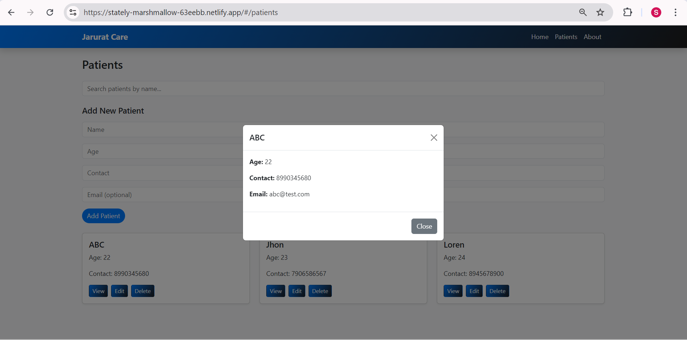

# Patient Records Dashboard

A React + Vite dashboard for managing patient records.

## Live Demo
[Netlify Link](https://stately-marshmallow-63eebb.netlify.app/)

## Features
- View, add, and manage patient records
- Built with React, Vite, React Router, and Bootstrap
- Responsive design

## Screenshots

## Setup Instructions
1. Clone the repository:
bash
git clone https://github.com/shwetaratnapure139/patient-records-dashboard.git
cd patient-records-dashboard
